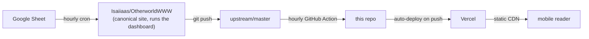

# Otherworld 2026 — Mobile-First Mirror

A mobile-first, read-only mirror of the unofficial Otherworld 2026 community schedule. Live at **[otherworld2026.vercel.app](https://otherworld2026.vercel.app)**.

Not affiliated with Kindle Arts Society or Otherworld.

---

## Credit where it's due

This is a fork of **[Isaiiaas/OtherworldWWW](https://github.com/Isaiiaas/OtherworldWWW)** — the original community schedule that does the actual heavy lifting: it talks to camp owners, ingests their edits from a shared Google Sheet, runs the dashboard where they self-edit, and reconciles everything into a clean `events.json` every hour. Without Isaiiaas's project, this fork wouldn't have any data to display.

Huge thanks to Isaiiaas for building (and keeping running) the canonical site — please support that project first.

---

## What this fork is

A static, mobile-first take on the same data, deployed on Vercel. The data pipeline still lives entirely upstream:

- **Upstream owns the data.** Camp owners edit via Isaiiaas's [Google Sheet](https://docs.google.com/spreadsheets/d/1o9Ue218Yx8mMa9OGyPfd66NoofYI3O1ewkN8NB-qnVc) or dashboard, just like before.
- **This fork mirrors it.** A GitHub Action pulls fresh `events.json` (and a handful of related data files) from upstream every hour, commits it to this repo, and Vercel auto-deploys the static site.
- **No PHP, no server, no database.** Just `index.html` + `styles.css` + `app.js` + the data files.

If upstream goes down, this mirror's data gets stale but nothing breaks. If this mirror goes down, the canonical site is unaffected.

---

## Philosophy / what's different

- **Mobile-first, then desktop.** Designed for the festival-attendee on Vancouver Island standing in a field with one bar of cell signal — not for a planner sitting at a desk. Header collapses on scroll, modals are bottom-anchored sheets on phones, tap targets are thumb-sized.
- **Installable as a PWA.** Add to Home Screen on iOS / Android gets you a full-screen icon-launched experience, with the schedule available offline after the first load.
- **No build step.** Open `index.html` in a browser locally and it works. Edit the CSS, refresh — that's the dev loop.
- **Defensive, opinionated UI.** Favorites are stored in `localStorage` with a normalised key (camp + day + title with accents/emoji/punctuation stripped) so a camp owner fixing a typo in their event title doesn't silently unstar it for everyone. There's a backup/restore flow for the same reason.
- **Honest about being a mirror.** The About panel shows the actual `lastReconciledAt` timestamp from upstream, so users always know how fresh the schedule is.

---

## Notable changes vs. upstream

- Native `<dialog>` modals with iOS-friendly bottom-sheet behaviour on small screens
- Settings sheet with toggleable description density, favorites backup/restore, and dev-mode time simulation for previewing the schedule mid-festival
- "Red-tier favorites" — a visual treatment to make starred events pop out of the timeline
- PWA install support (manifest, themed status bar, dedicated icons at 16/32/180/192/512)
- Split codebase: `index.html` + `styles.css` + `app.js` instead of one monolithic file
- iOS Safari modal stability fixes (viewport unit fallbacks, map prewarm to avoid the keyboard-jump glitch)
- A few accessibility passes (aria-pressed states, focus management, dialog-native escape handling)
- All the PHP / dashboard / reconciler pieces are stripped from the deploy — they're not removed from the repo (so upstream merges stay clean) but `.vercelignore` keeps them out of production

---

## Architecture



The cron + hourly reconcile happens upstream. We just pull data files (never source) and serve them.

---

## Repo layout

```
index.html              # Page shell
styles.css              # All styles
app.js                  # All client-side logic
events.json             # Schedule data (mirrored hourly from upstream)
data.js                 # Legacy artifact, also mirrored
map.webp                # Festival map image (fork-maintained, ~1.6 MB WebP)
map-data.js             # Pin overlays for the map view
map-locations.json      # Pin source data
map-labels.json         # Label clusters
camp-aliases.json       # Camp-name typo fixes

.github/workflows/      # GitHub Action that mirrors data from upstream
vercel.json             # Cache-Control headers
.vercelignore           # Excludes PHP / admin / scripts from deploy

admin/, scripts/, *.php # Inherited from upstream, NOT deployed.
                        # Left in place so upstream merges stay tidy.
docs/                   # Internal design notes
```

---

## Running locally

```bash
# Any static server works. Two zero-install options:
python3 -m http.server 8000
# or
npx serve .
```

Then open `http://localhost:8000`. No build, no deps.

---

## Deploying your own copy

This repo is set up to deploy on Vercel out of the box:

1. Fork it.
2. Import the fork on [vercel.com/new](https://vercel.com/new) — framework preset "Other", no build command.
3. (Optional but recommended) Enable the **Sync data files from upstream** GitHub Action so your fork auto-pulls fresh schedule data every hour. It's already in `.github/workflows/sync-upstream-data.yml`; you may need to manually trigger it once from the Actions tab to grant permissions.

That's it. Every push (yours + the hourly sync) auto-deploys.

---

## Contributing

PRs welcome for:

- UI / mobile / accessibility fixes
- PWA + offline improvements
- Performance work

PRs **not** welcome here:

- Schedule data changes — those go upstream (the [Google Sheet](https://docs.google.com/spreadsheets/d/1o9Ue218Yx8mMa9OGyPfd66NoofYI3O1ewkN8NB-qnVc) or the upstream dashboard). This fork mirrors them on the next hourly sync.
- Dashboard / reconciler / PHP changes — those belong in [upstream](https://github.com/Isaiiaas/OtherworldWWW).

---

## License

No explicit license set yet (upstream hasn't published one either). Treat as "all rights reserved" until a `LICENSE` file lands. If you want to reuse the code, open an issue.

---

> This website is not affiliated with Kindle Arts Society or Otherworld. It is a community-maintained tool. All schedule data flows from camp owners through the upstream pipeline maintained by Isaiiaas.
